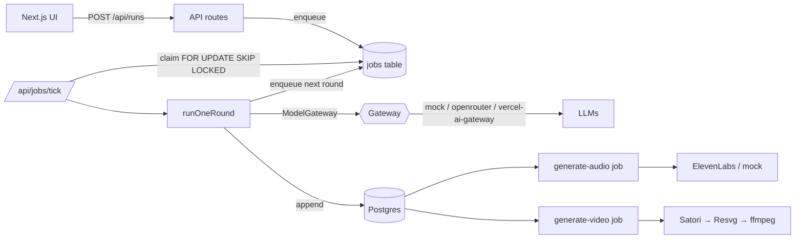

# LLM Scenario Arena

Multi-agent fiction sandbox where several LLMs play characters inside a
scenario you design — survival dilemmas, courtroom debates, board-room
negotiations — while a separate LLM acts as the canonical-state judge. The
result is a transcript, a narrated audio version, and an optional storyboard
MP4.

The project is built to be **runnable in three modes** without changing
code:

- **Mock-only** (`pnpm dev`) — zero API keys, deterministic seeded dialogue,
  end-to-end transcript + Markdown export. Good for exploring the UI and
  contributing.
- **Self-host** (BYOK) — point at OpenRouter or the Vercel AI Gateway with
  your own keys; render audio with ElevenLabs; render MP4 locally via the
  bundled ffmpeg binary.
- **Hosted Vercel demo** — `DEMO_MODE=true` tightens the cost/round/output
  caps, enables a per-IP daily rate limit, and refuses long video renders.

> **Status:** alpha. Built as an OSS portfolio project. Self-hosters bring
> their own keys; hosted demo runs under strict per-run cost caps (default
> ≤ $0.25/run).

---

## Quick start (mock mode, no keys)

```bash
git clone <repo-url>
cd llmorchestration
cp .env.example .env.local
pnpm install
pnpm dev
```

Open <http://localhost:3000>, click **Start Plane Crash Demo**, watch three
mock actors and a mock judge negotiate four parachutes across three rounds.
Export the transcript as Markdown when it finishes.

`pnpm test` exercises 130+ unit tests across the gateways, engine, jobs,
moderation, audio, and storyboard layers.

## Real-gateway setup (BYOK)

Pick a gateway, add the key, restart `pnpm dev`:

```bash
# OpenRouter (single key, OpenAI-compatible)
MODEL_GATEWAY_PROVIDER=openrouter
OPENROUTER_API_KEY=sk-or-v1-...

# OR Vercel AI Gateway
MODEL_GATEWAY_PROVIDER=vercel-ai-gateway
VERCEL_AI_GATEWAY_API_KEY=vgk_...
```

See [`docs/api-keys.md`](docs/api-keys.md) for the full provider matrix and
[`docs/model-gateways.md`](docs/model-gateways.md) for the gateway
abstraction.

## Architecture (one paragraph)

The engine never imports a provider SDK directly. Every model call goes
through the `ModelGateway` interface in
[`src/server/gateways/types.ts`](src/server/gateways/types.ts). A run is
broken into **per-round jobs** drained from a Postgres-backed `jobs` table
(or in-memory in dev) by `/api/jobs/tick`. Round handlers fan out actor
calls with `Promise.allSettled`, then ask the judge for a JSON state update,
which is validated, applied, and persisted before the next job is enqueued.
Audio (ElevenLabs) and video (Satori → Resvg → ffmpeg) are downstream jobs
that read the persisted transcript. Full diagram in
[`docs/architecture.md`](docs/architecture.md).



## Features

- **8 starter scenario templates** — survival dilemmas, debates, negotiation,
  game theory, reality show, medieval council. Each is fully populated with
  facts, rules, and termination conditions; users can clone and edit.
- **Two real model gateways** — OpenRouter (single key, OpenAI-compatible)
  and the Vercel AI Gateway (OIDC-auto on Vercel deploys). Hot-swap with one
  env var.
- **Per-round jobs with stale-lock recovery** — DB-backed queue with
  `FOR UPDATE SKIP LOCKED` claims, 60s leases, and `attempts` counter; a
  crashed worker is reclaimed on the next tick.
- **Cost & safety caps** — preflight rejection of overlong runs, mid-run
  budget aborts (`terminationReason=cost_cap`), per-IP daily limits, and a
  global kill switch (`GLOBAL_AI_KILL_SWITCH=true`) that stops every paid
  call instantly.
- **Moderation that runs before any paid call** — keyword baseline (named
  entities, hate slurs, violence/illegal/self-harm/voice-impersonation)
  with an optional `MODERATION_PROVIDER=openai` upgrade for richer
  classification.
- **Audio** — ElevenLabs by default (`eleven_turbo_v2_5`), mock provider
  for free CI/dev. Long messages chunk at sentence boundaries; per-clip
  failures don't fail the run.
- **Storyboard video** — five default visual styles (dark cockpit,
  courtroom, reality-show confessional, sci-fi control room, clean
  slideshow), local MP4 render via the bundled ffmpeg binary, plus a
  storyboard-JSON export for external workers.

## Hosted demo limits

`DEMO_MODE=true` (Vercel project setting) tightens caps to:

| Cap | Self-host floor | Hosted demo |
| --- | --- | --- |
| Participants per run | 6 | 3 |
| Rounds per run | 6 | 3 |
| Output tokens per call | 400 | 300 |
| Estimated cost per run | $0.25 | $0.25 |
| Runs per IP per day | 3 | 3 |

A demo can never loosen past the operator's env floor. See
[`docs/safety.md`](docs/safety.md).

## Deploy

[](https://vercel.com/new/clone?repository-url=https%3A%2F%2Fgithub.com%2Fvictory-c%2Fllmorchestration&env=DEMO_MODE,MODEL_GATEWAY_PROVIDER,DATABASE_URL,DIRECT_URL&project-name=llm-scenario-arena&repository-name=llmorchestration)

Full instructions: [`docs/deployment.md`](docs/deployment.md).

## Repo layout

```
src/
  app/                 Next.js App Router pages + API routes
  server/
    engine/            runOneRound, prompt builders, judge validator
    gateways/          ModelGateway interface + mock/openrouter/vercel adapters
    jobs/              memory + DB-backed queue, /tick handler, leases
    safety/            moderation + rate limiting + cost enforcement
    cost/              estimateCost, enforceLimits, logUsage
    media/             storyboard, scene render, ffmpeg pipeline, audio gen
    tts/               provider abstraction (mock + ElevenLabs)
    storage/           local / vercel-blob / supabase / s3 / r2
    db/                Drizzle schema + queries + pglite test harness
    scenarios/         8 starter templates + builder
    store/             repository pattern (memory + DB stores)
docs/
  architecture.md
  api-keys.md
  deployment.md
  model-gateways.md
  safety.md
  video-pipeline.md
.github/workflows/ci.yml
```

## Contributing

PRs welcome. Read [`CONTRIBUTING.md`](CONTRIBUTING.md) first, especially the
"don't commit secrets or generated media" section. CI runs typecheck, lint,
vitest, and a Next.js production build on every PR.

## Safety

The arena is designed for fictional scenarios. It will reject scenarios that
target real people, encourage self-harm, request voice impersonation, or
contain instructions for real-world violence or illegal operations. See
[`docs/safety.md`](docs/safety.md) for the full policy and how to extend it.

## License

[MIT](LICENSE).
